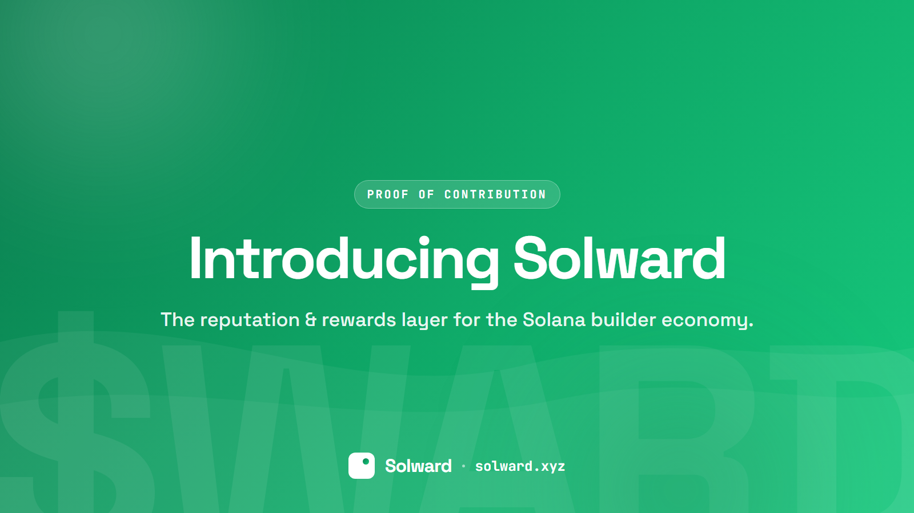
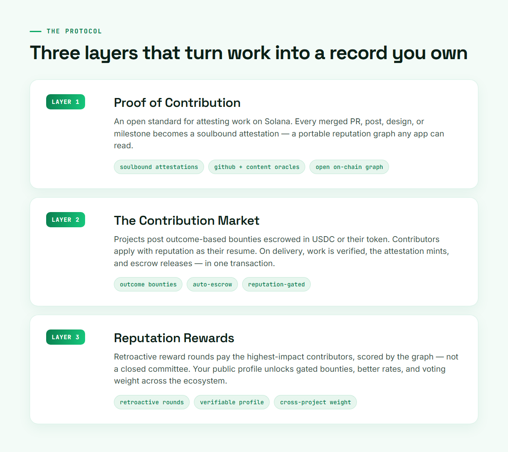
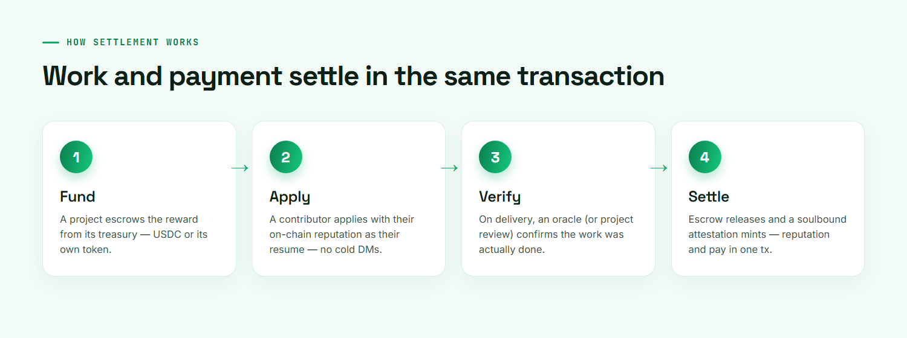
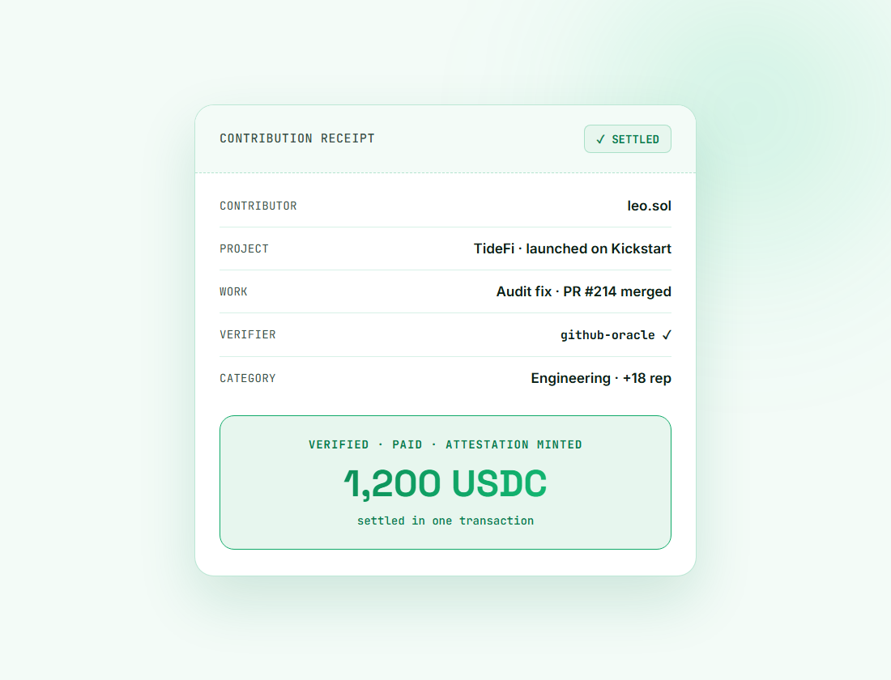

# Introducing Solward: Proof of Contribution for the Solana Builder Economy

**Build the chain. Own your record.**

*June 2026 · solward.xyz*

---

On Solana, money settles in 400 milliseconds. A swap, a transfer, a loan — all final, verifiable, and yours, in less than half a second.

Contributions still settle in trust.

The developer who ships the critical fix, the designer who gives a protocol its identity, the writer whose thread turns a quiet launch into a movement — their work is what actually makes the ecosystem run. Yet none of it follows them. It lives in screenshots, Discord roles, and a founder's memory. When that founder moves on, the record disappears.

Solward fixes that. It turns real contributions to Solana projects — code, content, design, community, and capital — into **verifiable, on-chain reputation that earns rewards.** It is the missing settlement layer between the people who build the ecosystem and the projects that depend on them.

## The problem nobody priced

Launchpads like EasyA Kickstart and pump.fun removed the hardest barrier in crypto: going from an idea to a live, tradable token now takes minutes. That was supposed to unlock building. Instead, it exposed the next bottleneck.

When launching is free, the scarce resource becomes **credible contribution** — and the ecosystem has no rail for it.

- **Contributors are invisible.** Your reputation doesn't travel. Every new project, you start from zero and prove yourself again with links and vibes.
- **Projects can't find or trust talent.** A founder fresh off a launch has a token and momentum but no reliable way to find a vetted contributor, confirm they did the work, and pay for outcomes instead of promises.
- **Rewards are arbitrary.** Airdrops reward wallets, not work. Bounties get gamed. Grant committees move slowly. The value that was actually created is never measured.

The result is a builder economy running on goodwill and trust-me-bro. That doesn't scale to the next ten million people who want to build on Solana.

## The insight

> Every other coordination problem on Solana was solved with a verifiable, composable primitive — payments, swaps, staking, lending, RWAs. Contribution and reputation never were.

That's the gap Solward closes: a permissionless, on-chain **proof-of-contribution** standard, plus the marketplace and reward rails that sit on top of it.

## What Solward is

Solward is three layers that build on each other — an open primitive at the base, a marketplace in the middle, and compounding rewards on top.

**Layer 1 — Proof of Contribution.** An open standard for attesting work on Solana. A merged PR, a published post, a design delivery, a community milestone — each becomes a *soulbound attestation* tied to your wallet, issued by projects, peers, or automated oracles, and weighted by the issuer's own reputation. The result is a portable, composable reputation graph that any app on Solana can read and build on.

**Layer 2 — The Contribution Market.** A marketplace where projects post outcomes and contributors get paid for delivering them. Bounties are escrowed in USDC or the project's own token. Contributors apply with their Solward reputation as their resume — no LinkedIn, no cold DMs.

**Layer 3 — Reputation Rewards.** Reputation that compounds into recurring upside. Projects and ecosystem funds run retroactive reward rounds that pay the highest-impact contributors, scored objectively by the graph instead of by a closed committee. Your public profile unlocks gated bounties, better rates, allowlist spots, and voting weight across any project that reads it.

## How it works

The magic is in the settlement. Work, verification, reputation, and payment all resolve in the same flow — and, on-chain, in the same transaction.

Walk through a real scenario.

A founder, **Maya**, launches *TideFi* on EasyA Kickstart. The token is live; the team is not. She opens Solward and funds three bounties straight from TideFi's treasury: a smart-contract audit fix, a launch-week content campaign, and a brand kit.

**Leo**, a developer, sees the audit bounty. His Solward profile already shows 14 verified PRs across three Solana projects, so he clears the reputation gate automatically. He ships the fix. A GitHub oracle confirms the merge. Escrow releases the USDC and mints a soulbound attestation to his wallet — in one transaction.

Two months later, the Solana Foundation runs a retroactive round rewarding top contributors to new launches. Because Leo's work is on-chain and scored, he's paid automatically — no application, no committee. His proof is public, so the next founder finds him instantly.

The flywheel turns.

## Why Solana, and why now

This only works here, and the timing only works now.

- **The launchpad needs a labor layer.** Kickstart makes ideas instantly tradable. The natural next question — *who builds the idea, and how do they get paid?* — is exactly what Solward answers. Every launch becomes fundable with talent, not just capital.
- **It's composable, not a walled garden.** The reputation graph is open on-chain data. Jupiter, Drift, Superteam, hackathon organizers, and any future app can read it. Solward grows the whole ecosystem instead of fencing off a corner.
- **It's only viable at Solana speed and cost.** Sub-cent fees and sub-second finality make it economical to attest thousands of micro-contributions and settle micro-rewards — impossible on slower, costlier chains.

Three things became true at the same time in 2026: launching went free, Solana won the builders (10,000+ active developers), and the primitives — cheap attestations, oracles, same-transaction settlement — finally became practical. Solward sits at their intersection.

## The $WARD token

$WARD coordinates the three-sided market between projects, contributors, and verifiers.

- **Stake to attest.** Verifiers and issuers stake $WARD to vouch for work; bad attestations are slashable, keeping the graph honest.
- **Reward rounds.** Funds and projects denominate retroactive rewards in $WARD or stablecoins routed through Solward.
- **Governance.** Holders set category weights, dispute rules, and treasury allocation.
- **Access.** The highest-reputation contributors and stakers unlock premium bounties and reduced fees.

Fair launch, builder-aligned — in the spirit of Kickstart. No presale, with a meaningful allocation reserved to reward contributors retroactively. The people who build Solward should hold Solward.

> *$WARD is a utility and governance token — not an investment, equity, or a claim on revenue or profit. Participation is speculative. Do your own research.*

## Roadmap

- **Phase 0 — Proof (now).** Concept, brand, community, and a working demo of the proof-of-contribution standard.
- **Phase 1 — The Market.** Launch the Contribution Market on mainnet with USDC-escrowed bounties and the first GitHub + content oracles. Onboard 25 launchpad-stage projects.
- **Phase 2 — The Graph.** Open the reputation graph as public on-chain data with a read API and SDK.
- **Phase 3 — Reward Rounds.** Run the first retroactive round with an ecosystem partner. Ship $WARD via fair launch.
- **Phase 4 — The Standard.** Become the default reputation layer referenced by launchpads, grant programs, and DAOs across Solana.

## The vision

Solana is becoming the settlement layer for the internet's economy. Solward makes sure the **people** who build it settle too — that every PR, post, design, and late night turns into reputation they own and rewards they earn, anywhere in the ecosystem, forever.

**Build the chain. Own your record.**

---

*Try the interactive preview and read the lite paper at [solward.xyz](https://solward.xyz).*
